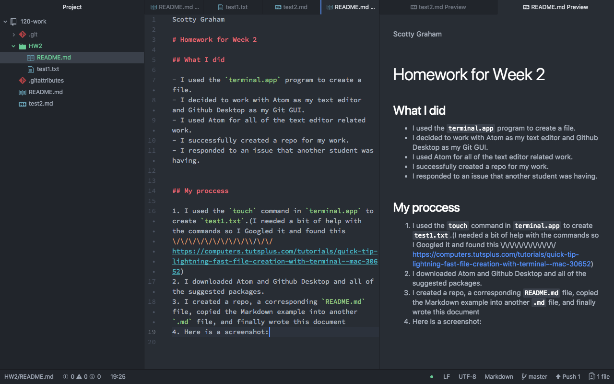
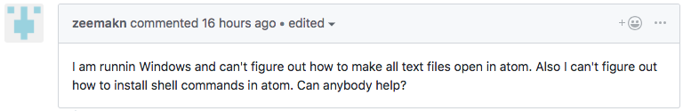
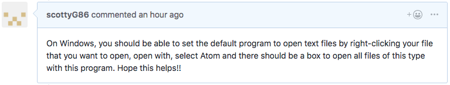

Scotty Graham

# Homework for Week 2

## What I did

- I used the `terminal.app` program to create a file.
- I decided to work with Atom as my text editor and Github Desktop as my Git GUI.
- I used Atom for all of the text editor related work.
- I successfully created a repo for my work.
- I responded to an issue that another student was having.

## My proccess

1. I used the `touch` command in `terminal.app` to create `test1.txt`.(I needed a bit of help with the commands so I Googled it and found this: \/ \/ \/ \/ \/ \/ \/ \/ \/ \/ \/ \/ \/ https://computers.tutsplus.com/tutorials/quick-tip-lightning-fast-file-creation-with-terminal--mac-30652)
2. I downloaded Atom and Github Desktop and all of the suggested packages.
3. I created a repo, a corresponding `README.md` file, copied the Markdown example into another `.md` file, and finally wrote this document 

## Obstacles I overcame

- The only problem I had was in the `terminal.app` and I was not using the correct syntax for `touch` to put a file in a specific location.
  - I solved this problem by googling it and using the information in this link: https://computers.tutsplus.com/tutorials/quick-tip-lightning-fast-file-creation-with-terminal--mac-30652

## Further discussion of topic

I found that using Markdown is a lot easier than I thought it would be. I may use it for other documents I would have to write outside of this class.

## Helping other students

I responded to @zeekmans issue. Here is my response.
