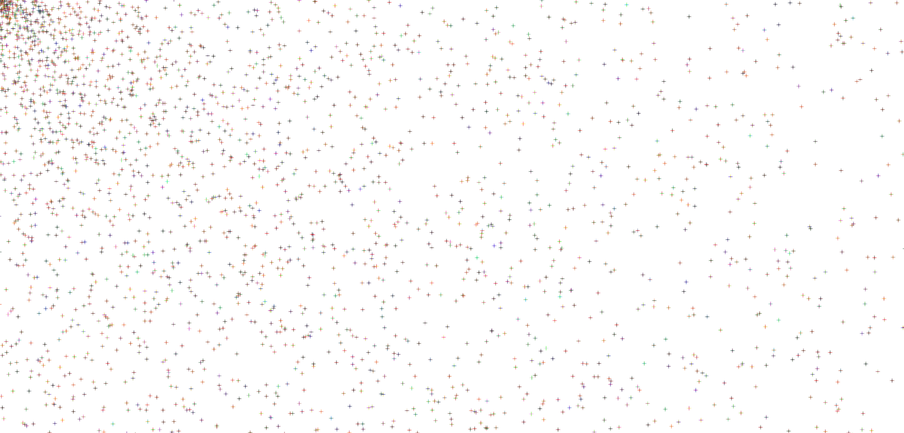

Scott Graham

https://scottyg86.github.io/120-work/hw-6/

# Homework for week 6

## What I did
 - I created a generative art sketch using an algorithm to handle random number inputs

 ## My process
 - I first created a program to create dots in the middle of the canvas to test my random color algorithm.
 - Then I started work on making a random number to change the position of the dots as they manifest
 - Lastly I used an algorithm to make the program start in the top left corner and move out.

 
